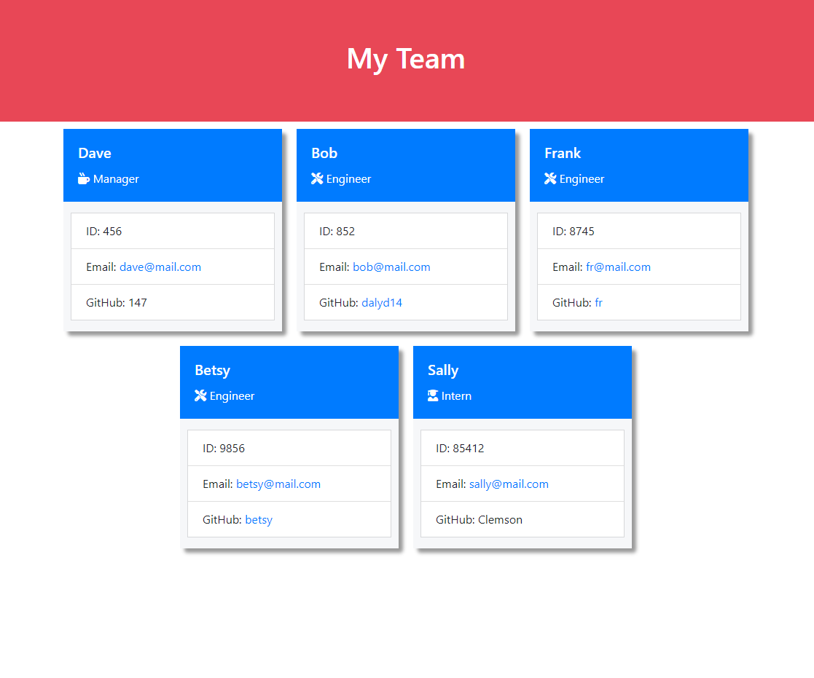

# Team Roster Generator

- [Project Walkthrough](https://drive.google.com/file/d/1X5Vd4F1BEkC2OzyvejTr0YfzqQJDiVa3/view)
- [GitHub Repository](https://github.com/dalyd14/team-profile-generator)



## Table of Contents
- [Project Description](#project-description)
- [Installation](#installation)
- [Usage](#usage)
- [Testing](#testing)
- [Questions](#questions)

## Project Description
This is a command line app that allows a user to enter a team's members and have the roster be outputted as an HTML page.

## Installation
1. This is a Node.js application: please make sure you have [node downloaded](https://nodejs.org/en/download/)
2. Create a local repository and [clone](https://docs.github.com/en/free-pro-team@latest/github/creating-cloning-and-archiving-repositories/cloning-a-repository) this GitHub repository to it.
3. Navigate to the folder in your terminal
4. Run the following command to install the required dependencies 
```
npm i
```
5. Type in 
```
node index
```
6. If there is an error, please make sure you did steps 1 and 2 correctly
## Usage
1. Run this from your terminal 
```
node index
```
2. Follow the prompts to fill out the team roster
3. When the app is done, you can find the output html in the dist folder
## Testing
Run the following code from the terminal 
```
npm test
```

## Questions
* Please visit my [GitHub Profile](https://github.com/dalyd14)
